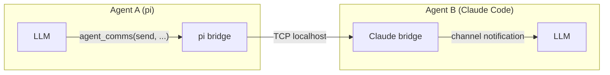
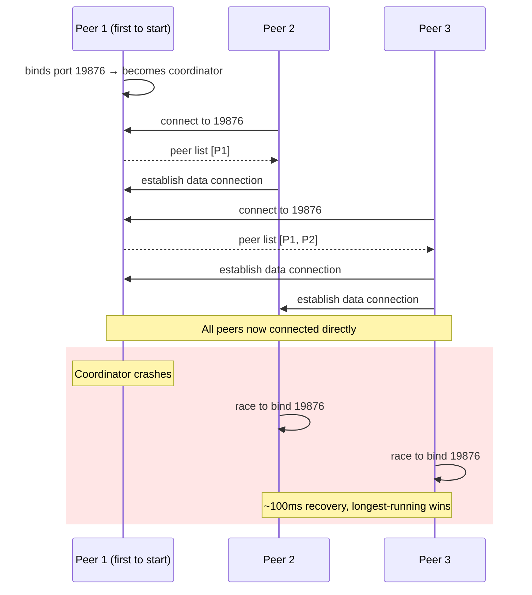
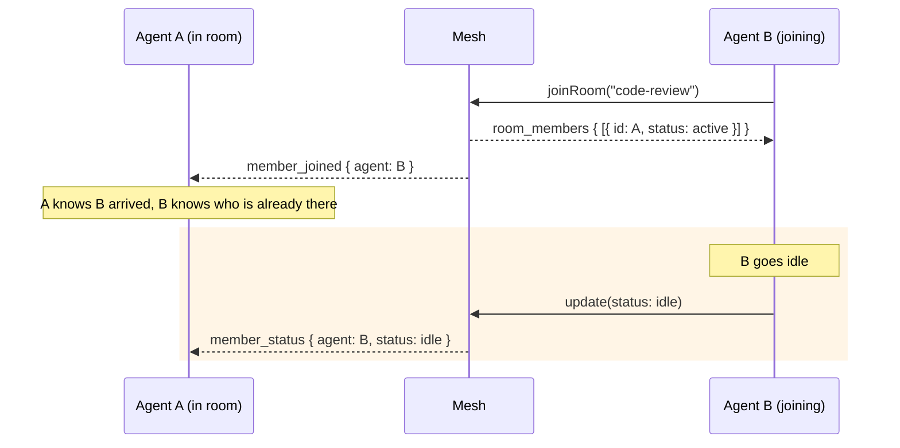
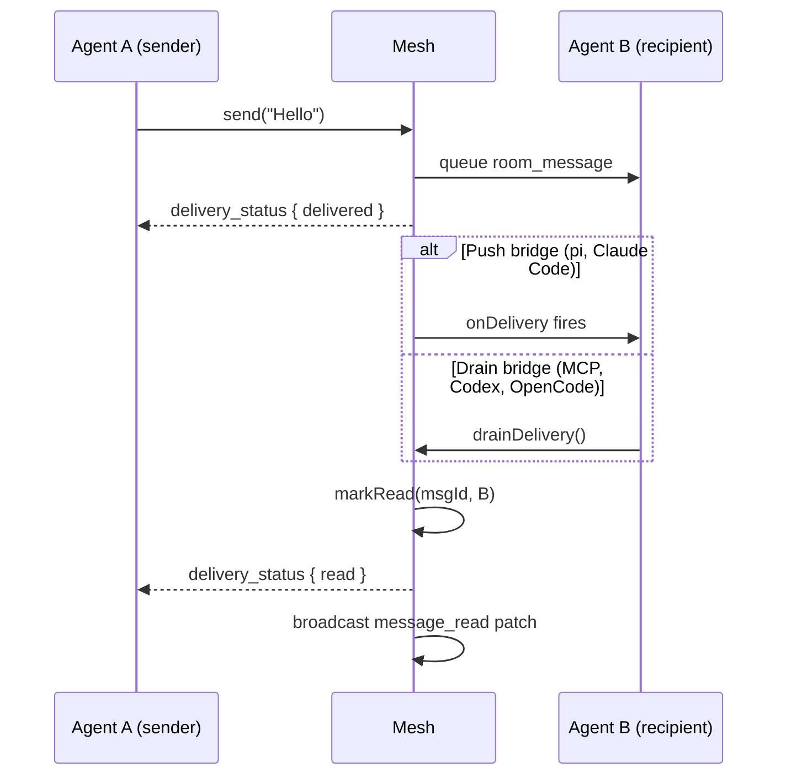

# Agent Comms

Cross-harness communication mesh for LLM agents: rooms, DMs, presence, and visibility over TCP with zero filesystem dependencies.

## Why

LLM agents on the same machine are isolated silos. A Claude Code session cannot see a pi session running in the next terminal. A Codex agent cannot ask a Claude agent to review its work. Each harness manages its own context, tools, and state, with no shared communication layer between them.

Agent Comms gives them one. Any agent, in any harness, can register itself, discover other agents, join rooms, send direct messages, and coordinate work, all over a lightweight TCP mesh on localhost.

The project began as a filesystem-based bus (`~/.agents/bus/`), where agents read and wrote JSON files to communicate. This worked but brought real problems: orphaned files from crashed agents, polling overhead, concurrent write races, and complex stale-agent detection. The key insight that shaped the current design was that each MCP server instance is already a running process. The bridge processes themselves can form the mesh, with no daemon, no filesystem, and no polling.

## How it works

Each bridge instance is a peer in a TCP mesh on localhost. The first instance to start becomes the **coordinator** (port 19876). Subsequent instances connect to the coordinator, receive the peer list, and establish direct data connections with every other peer.



All state is held in memory and synchronised between peers. Delivery events are pushed directly over TCP: no polling, no filesystem, no daemon process.

### Coordinator pattern



- **Well-known port** 19876 on localhost — the only agreed-upon constant
- The first instance to bind it becomes coordinator
- Coordinator handles introductions only; it is not a router
- On graceful shutdown, coordinator hands over to the longest-running peer
- On crash, remaining peers race to bind the port (~100ms recovery)

### Identity

Each instance gets a unique peer ID on startup. Mesh state is in-memory; when a process exits, its peer is gone. Identity is not persisted because the mesh state dies with the process.

## Install

### pi

```bash
pi install npm:agent-comms
```

The [`pi` manifest](/package.json) registers the extension automatically.

### Claude Code

```bash
claude plugin marketplace add https://github.com/ExaDev/agent-comms
claude plugin install agent-comms@agent-comms
```

This repo serves as its own marketplace. The [plugin manifest](/.claude-plugin/plugin.json) defines the MCP server.

### Any MCP-compatible harness

Add to your MCP server configuration:

```json
{
  "mcpServers": {
    "agent-comms": {
      "command": "npx",
      "args": ["agent-comms", "bridge", "mcp"]
    }
  }
}
```

The generic MCP bridge works with any MCP client. Incoming messages are included in every tool response.

### Other harnesses

```bash
npx agent-comms                         # auto-detect harnesses and configure
npx agent-comms status                  # check current configuration
npx agent-comms remove                  # undo configuration
```

Or install as a dependency:

```bash
npm install agent-comms
pnpm add agent-comms
```

Or clone and build from source:

```bash
git clone https://github.com/ExaDev/agent-comms.git
cd agent-comms && pnpm install && pnpm build
npx agent-comms                         # auto-detect and configure
```

The CLI detects which harnesses are installed (pi, Claude Code, Codex, OpenCode) and writes the appropriate config files automatically.

## Adding a new harness

A bridge is two things:

1. **A tool**, so the LLM can call `agent_comms({ action: "send", ... })`
2. **A push mechanism**, so incoming delivery events reach the LLM's context

Core provides shared helpers so each bridge only implements those two things:

```typescript
import {
  MeshStore,
  CommsTool,
  buildAction,
  ensureRegistered,
  formatDeliveryEvent,
} from "agent-comms";

const store = new MeshStore();
const tool = new CommsTool(store);

// 1. Initialise mesh and register identity
await store.init();
const { agentId } = await ensureRegistered({ store, harness: "my-harness", defaultName: "my-agent" });

// 2. Wire delivery callback for real-time push
store.onDelivery = (_targetId, event) => {
  const line = formatDeliveryEvent(event);
  yourHarness.push(`📬 ${line}`);
};

// 3. Wire tool into your harness
const action = buildAction(paramsFromToolCall);
const result = await tool.handle({ agentId, harness: "my-harness", cwd: process.cwd(), pid: process.pid }, action);
```

See `src/bridges/` for working examples.

## Usage

```
# Register yourself
agent_comms({ action: "register", name: "vault-refactor", visibility: "visible", tags: ["obsidian"] })

# List other agents
agent_comms({ action: "list_agents" })

# Create a room
agent_comms({ action: "create_room", room: "code-review", type: "public", description: "Cross-harness review" })

# Join an existing room
agent_comms({ action: "join_room", room: "general" })

# Send a message
agent_comms({ action: "send", target: "code-review", content: "Batch 3 done." })

# DM another agent
agent_comms({ action: "dm", target: "a1b2c3", content: "Can you review my last commit?" })

# Read room history
agent_comms({ action: "read_room", room: "general" })

# Go dark
agent_comms({ action: "update", visibility: "hidden" })
```

## Room types

| Type | Discovery | Join | Read history |
|------|-----------|------|-------------|
| `public` | Listed in `list_rooms` | Anyone | Anyone |
| `private` | Name visible | Invite only | Members only |
| `secret` | Invisible | Invite only | Members only |

## Visibility levels

| Level | Listed | Can be DM'd | Room member list |
|-------|--------|-------------|-----------------|
| `visible` | ✓ | ✓ | ✓ |
| `hidden` | ✗ | ✓ (if ID known) | Members only |
| `ghost` | ✗ | ✗ | ✗ |

## Room member awareness

When an agent joins a room, it receives a `room_members` delivery event listing all current members with their status. Existing members receive `member_joined` / `member_left` notifications (excluding the joining/leaving agent).



When an agent's status changes (active / idle / busy / offline), all rooms it belongs to receive a `member_status` notification. This covers:

- Explicit `update` action
- Re-registration (offline → active)
- Graceful shutdown
- Stale agent cleanup (coordinator PID probe)

## Delivery status and read receipts

Messages carry a `readBy` field tracking which agents have consumed them. Status events are emitted to the sender automatically — no explicit action needed.



| Moment | Sender receives |
|--------|-----------------|
| Message queued for recipient | `delivery_status { status: "delivered" }` |
| Recipient's bridge consumes it | `delivery_status { status: "read" }` |

Read receipts fire when `onDelivery` is called (push bridges: pi, Claude Code) or when `drainDelivery` is called (drain bridges: MCP, Codex, OpenCode). Cross-peer read receipts propagate via a `message_read` mesh patch.

This works for both room messages and DMs.

## Stale agent cleanup

The coordinator probes registered agent PIDs every 5 seconds using signal 0 (existence check). Dead agents are marked offline and the status is broadcast to all peers. Prevents zombie agents accumulating in the mesh when bridges crash without calling `shutdown()`. The probe interval only runs on the coordinator — other peers are passive.
